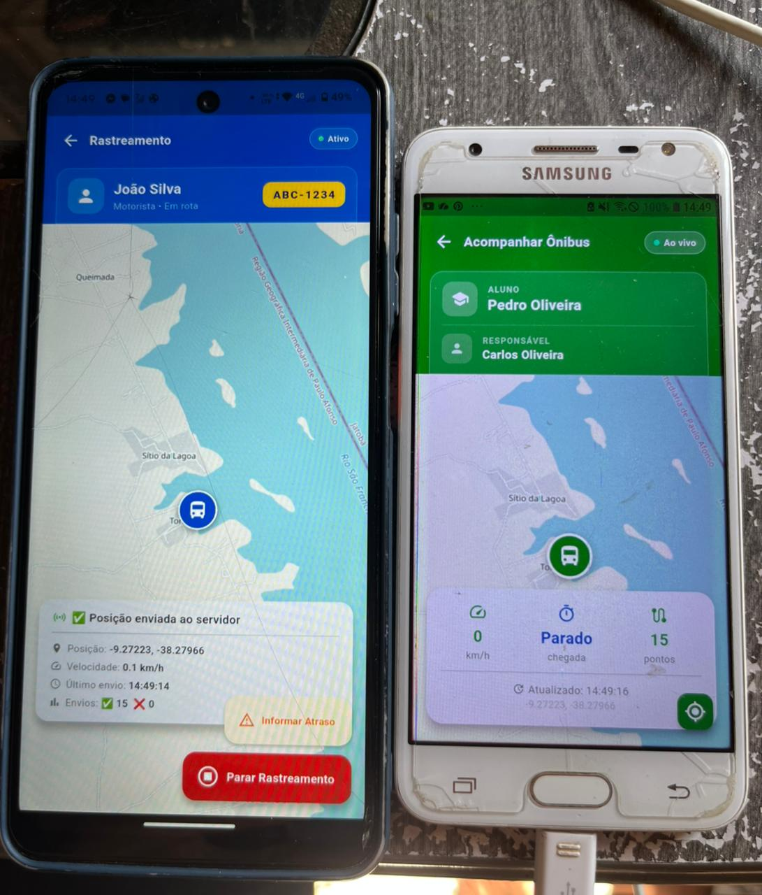

# 🚌 BusTracker - Sistema de Rastreamento Escolar (Paulo Afonso-BA)

O **BusTracker** é uma solução Full Stack real, idealizada e desenvolvida para monitorar o transporte escolar no Sertão da Bahia. O sistema permite que motoristas enviem sua localização em tempo real e que pais/responsáveis acompanhem o trajeto, velocidade e estimativa de chegada diretamente pelo celular.

## 🚀 Sobre o Desenvolvimento (Realidade do Projeto)

Este projeto é fruto de uma iniciativa **totalmente autoral**, unindo a necessidade real da região de **Paulo Afonso-BA** com as tecnologias que venho dominando no **IFBA**. 

A construção do **BusTracker PA** seguiu uma dinâmica de mercado moderna:

* **Arquitetura e Ideação:** Toda a estrutura do sistema, desde a modelagem do banco de dados em Java (Spring Boot) até a lógica de rastreamento, foi idealizada por mim.
* **Pair Programming com IA:** No processo de codificação, utilizei o **Claude (Anthropic)** como meu parceiro de programação. Ele foi essencial para agilizar a criação das interfaces no Flutter e auxiliar no debugging de ambiente no **Linux Ubuntu**, permitindo que eu focasse 100% na lógica de negócio e na integração do ecossistema.
* **Propósito:** Estou muito animado com o potencial desse projeto! Aplicar o que aprendi em Lógica de Programação e Java para resolver um problema do meu cotidiano é o que me motiva a evoluir como desenvolvedor.

---

### 📱 Sobre o Projeto
O aplicativo conecta a frota municipal aos cidadãos, trazendo segurança e previsibilidade para o transporte de alunos em Paulo Afonso — BA. O diferencial do projeto é a segmentação de perfis, garantindo que a informação certa chegue à pessoa certa.

#### ✅ Funcionalidades Atuais (MVP)

**Para o Motorista:**
* **Identificação:** Login personalizado com nome cpf e placa do veículo.
* **Telemetria:** Envio automático de localização GPS a cada 10 segundos para o servidor.
* **Gestão de Percurso:** Botões de controle para embarque/desembarque de alunos.
* **Comunicação de Incidentes:** Informe de atrasos com lista pré-definida (pneu furado, trânsito, etc) ou motivo personalizado.
* **Monitoramento:** Visualização da própria posição e velocidade no mapa.

**Para o Pai / Responsável:**
* **Autenticação de Responsáveis** Integração completa entre o aplicativo Flutter e o backend Spring Boot para validação de matrícula e nome do responsável.
* **Acesso Seguro:** Login utilizando a matrícula do aluno e nome do responsável.
* **Mapa ao Vivo:** Acompanhamento do ônibus em tempo real com rastro do percurso.
* **Painel de Informações:** Visualização da velocidade atual, status da conexão e última atualização.
* **Alertas:** Banner de notificação imediata caso o motorista informe algum atraso ou imprevisto.

---

## 📸 Demonstração do Aplicativo

O sistema conta com interfaces distintas e intuitivas para cada tipo de usuário.

### 🏠 Fluxo de Acesso
| Seleção de Perfil | Cadastro Motorista | Cadastro Pai / Responsável |
|:---:|:---:|:---:|
|  |  |  |
| Escolha entre os perfis | Identificação por Nome e Placa | Acesso via Matrícula e Nome |

### 🚛 Interface do Motorista (Em Rota)
| Aguardando Início | Localização Enviada | Alerta de Atraso | Opções de Atraso |
|:---:|:---:|:---:|:---:|
|  |  |  |  |
| Mapa de Paulo Afonso | Confirmação de envio ao Java | Status de atraso ativo | Motivos pré-definidos |

### 👨‍👩‍👦 Interface dos Pais (Acompanhamento)
| Monitoramento ao Vivo | Falha de Conexão (Tratamento de Erro) |
|:---:|:---:|
|  |  |
| Visualização do ônibus e velocidade | Feedback em tempo real sobre instabilidades |

---
### 🗄️ Persistência de Dados (PostgreSQL)

O backend em **Java / Spring Boot** recebe as coordenadas do Flutter e as persiste no banco de dados local. Abaixo, um registro das posições enviadas em tempo real:

| Tabela de Localização no Banco |
|:---:|
|  |
| Registro de Latitude, Longitude, Nome, Placa e CPF do Motorista |

---
### 👨‍👩‍👧‍👦 Gerenciamento de Responsáveis e Alunos

Para garantir a segurança, o sistema faz o controle de acesso dos pais e responsáveis, vinculando-os diretamente à matrícula e ao status de atividade do aluno.

| Registro de Responsáveis (Banco de Dados) |
|:---:|
|  |
| **Atributos principais:** Nome do Responsável, Matrícula, Status (Ativo/Inativo), Data de Criação e Nome do Aluno vinculado. |

> **Nota:** O campo `status_ativo` permite que a administração do transporte bloqueie o acesso de alunos que trancaram o semestre ou não renovaram o auxílio transporte, garantindo que apenas usuários autorizados vejam a localização em tempo real.

---
## 📱 Demonstração em Tempo Real

Abaixo, você pode ver o sistema em funcionamento com dois dispositivos reais.

<p align="center">
  
</p>

### O que esta imagem demonstra:

1.  **Celular da Esquerda (Motorista):**
    * **App Ativo:** O status está "Ativo" (bolinha verde).
    * **Envios com Sucesso:** 15 pacotes de localização foram enviados ao backend (Spring Boot via ngrok).
    * **Mapa:** Mostra a localização atual do motorista torquato (povoado onde moro).
    * **Ações:** Botões para "Informar Atraso" e "Parar Rastreamento".

2.  **Celular da Direita (Pai/Aluno):**
    * **Status do Ônibus:** Exibe "Ao vivo", indicando que está recebendo atualizações recentes.
    * **Placa do Veículo:** Identifica o ônibus sendo rastreado (ABC-1234).
    * **Mapa:** Mostra o ícone do ônibus se movendo em tempo real, consumindo os dados enviados pelo motorista.
    * **Última Atualização:** Mostra o horário exato da última posição recebida.

> **Nota:** Esta demonstração valida a integração completa entre os aplicativos móveis (Flutter), o servidor backend (Spring Boot), o banco de dados (PostgreSQL) e o tunelamento de rede (ngrok), garantindo a comunicação mesmo em redes diferentes.

## 🚀 Teste de Campo: Validação Real-Time

O sistema foi colocado à prova em um cenário real de longa distância, conectando o **Distrito de Quixaba** ao **povoado Torquato (Glória - BA)**. O teste validou a estabilidade da arquitetura em redes móveis instáveis.

<div align="center">
  
  
  
</div>

### 📱 Demonstração em Tempo Real

<p align="center">
  <kbd>
    
  </kbd>
  &nbsp;&nbsp;&nbsp;&nbsp;
  <kbd>
    
  </kbd>
</p>

<p align="center">
  <b>Monitoramento do Servidor (Túnel Ngrok)</b><br>
  
</p>

---

### 🔍 Detalhes Técnicos do Fluxo
> **Caminho do Dado:** > `📍 Quixaba (App Motorista)` ➔ `🛰️ Rede 4G` ➔ `🌩️ Ngrok (Proxy)` ➔ `☕ Spring Boot (Local)` ➔ `📍 Torquato (App Pai)`

* **Backhaul:** Túnel HTTP via Ngrok expondo o servidor local.
* **Geolocalização:** GPS de alta precisão com filtragem de ruído.
* **Segurança:** Handshake validado via Spring Security.

---

## 📈 Roadmap de Evolução

O BusTracker PA não para por aqui. Confira o que está sendo desenvolvido:

- [ ] **🔔 Alertas de Atraso:** Notificações Push instantâneas (Pneu furado, trânsito, etc).
- [ ] **⏱️ Refinamento de ETA:** Algoritmo preditivo de tempo de chegada.
- [ ] **🚧 Geofencing:** Cercas virtuais para avisos automáticos de proximidade.

### 🛠️ Tecnologias Utilizadas

#### **Backend (Java Spring Boot)**
* **Linguagem:** Java 21
* **Framework:** Spring Boot 3.5.12 (Spring Data JPA)
* **Banco de Dados:** PostgreSQL (Gerenciado via DBeaver)
* **Produtividade:** Lombok para redução de código boilerplate.
* **Infraestrutura:** Servidor rodando em **Linux Ubuntu** com túnel reverso via **Ngrok** para testes externos em rede móvel (4G).

#### **Mobile (Flutter)**
* **Localização:** `geolocator` para captura de coordenadas GPS reais.
* **Mapas:** `flutter_map` (OpenStreetMap) e `latlong2`.
* **Comunicação:** Pacote `http` para integração com API REST (JSON).
* **Internacionalização:** `intl` para formatação de datas e horas locais.

---

### 🗂️ Estrutura do Projeto

```text
📦 rastreamento_escolar/          # App Flutter
└── lib/
    ├── main.dart
    ├── screen/ (tela_selecao_perfil.dart, tela_motorista.dart, tela_pai.dart)
    └── service/ (api_service.dart, location_service.dart)

📦 escolar-api/                   # Backend Java
└── src/main/java/.../
    ├── controller/ (RastreamentoController.java, AuthController.java)
    ├── service/ (RastreamentoService.java)
    ├── model/ (PosicaoVeiculo.java)
    └── config/ (CorsConfig.java)
