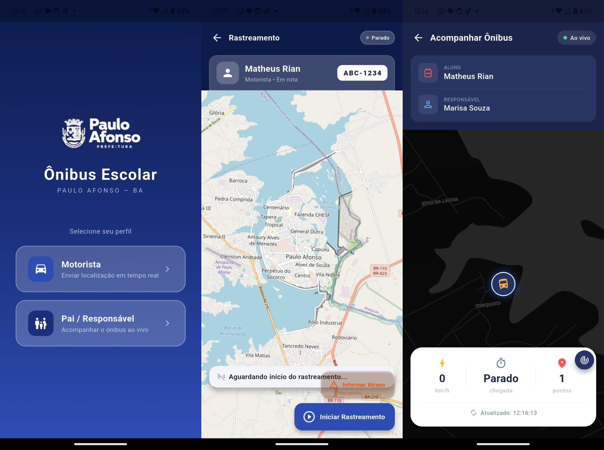

# BusTracker PA

Plataforma Full Stack de rastreamento veicular em tempo real para o transporte escolar público de Paulo Afonso (BA), projetada para operar com eficiência mesmo em cenários de conectividade instável.

---

## Visão Geral do Problema

No interior baiano, as famílias que dependem do transporte escolar enfrentam a falta de previsibilidade sobre os horários dos veículos. Isso resulta em tempos de espera excessivos expostos ao clima, atrasos sem aviso prévio e constante apreensão. 

O **BusTracker PA** mitiga essa vulnerabilidade entregando telemetria em tempo real com baixo custo operacional e arquitetura otimizada para redes móveis intermitentes.

---

## Demonstração da Interface

O ecossistema adota uma identidade visual sóbria baseada nas cores institucionais do município, utilizando mapas em modo noturno (*Dark Matter*) para otimizar o contraste e reduzir a fadiga visual dos responsáveis.

<p align="center">
  
</p>

### Fluxo Inicial e Cadastro
* **Seleção de Perfil:** Separação clara de escopo entre condutores e responsáveis.
* **Acessibilidade:** Cadastro simplificado focado em identificadores diretos (CPF e Placa do Veículo).

### Módulo do Motorista (Transmissão)
* **Operação Simplificada:** Interface acionável por um único clique para início do rastreamento.
* **Tratamento de Anomalias:** Menu nativo para reporte ágil de incidentes com categorias predefinidas (ex: pneu furado, problema mecânico, trânsito lento), notificando a base instantaneamente.

### Módulo do Responsável (Monitoramento)
* **Acompanhamento ao Vivo:** Renderização fluida da rota percorrida e vetor de deslocamento.
* **Robustez de Sinal:** Tratamento visual explícito para perda de conexão ou interrupção de envio pelo veículo.

---

## Validação em Campo

O Produto Mínimo Viável (MVP) foi validado em ambiente de produção real conectando o **Distrito de Quixaba** ao **Povoado Torquato** em Glória (BA). 

* **Condições de Teste:** Trechos rurais com alta oscilação e intermitência de sinal de dados móveis.
* **Performance Realizada:** A sincronização via túnel reverso registrou latência média de transmissão **inferior a 2 segundos**.
* **Persistência Garantida:** Logs de servidor confirmaram consistência no recebimento das requisições REST (POST) sob conexões de baixa largura de banda.

---

## Arquitetura do Sistema

A plataforma é estruturada em três camadas desacopladas, assegurando escalabilidade e fácil manutenção:

```
┌─────────────────────────────────────────────────────────────────┐
│                        CAMADA CLIENTE                           │
│                                                                 │
│   App Motorista (Flutter)  ──► POST /api/v1/rastreamento/enviar │
│   App Responsável (Flutter)──► GET  /veiculo/{placa}/posicao    │
└────────────────────────────────┬────────────────────────────────┘
                                 │ HTTP REST
┌────────────────────────────────▼────────────────────────────────┐
│                      CAMADA DE APLICAÇÃO                        │
│                     Spring Boot 3 · Java 21                     │
│                                                                 │
│   • RastreamentoController & RastreamentoService                │
│   • Firebase Admin SDK (Gerenciamento de Mensageria)           │
│   • Spring Data JPA (Camada de Abstração de Dados)             │
└────────────────────────────────┬────────────────────────────────┘
                                 │ Firebase Cloud Messaging (FCM)
┌────────────────────────────────▼────────────────────────────────┐
│                       NOTIFICAÇÕES PUSH                         │
│   Canal/Tópico: onibus_paulo_afonso                             │
│   Disparo assíncrono direcionado a múltiplos clientes           │
└─────────────────────────────────────────────────────────────────┘
```

### Ciclo de Telemetria e Eventos

1.  **Captura:** O aplicativo do motorista coleta coordenadas espaciais via GPS do aparelho utilizando a taxa de amostragem definida pelo serviço local.
2.  **Processamento:** O backend Java valida o payload, persiste o histórico espaço-temporal no banco de dados e analisa anomalias operacionais.
3.  **Distribuição:** Caso um alerta de atraso seja registrado, o serviço do Firebase propaga um evento para o tópico comum aos responsáveis associados àquela linha.

---

## Stack Tecnológica

### Frontend Mobile (Flutter)
* **Geolocalização:** `geolocator` para interface nativa de alta precisão com o hardware de GPS.
* **Mapeamento:** `flutter_map` integrado com `latlong2` sob camadas OpenStreetMap.
* **Comunicação:** Cliente HTTP nativo do ecossistema Dart.
* **Sincronização Push:** `firebase_messaging` para manipulação de payloads assíncronos.

### Backend (Spring Boot)
* **Ambiente Core:** Java 21 (LTS) e Spring Boot 3.x.
* **Persistência:** PostgreSQL com gerenciamento de conexões via Spring Data JPA.
* **Segurança e Conectividade:** Configuração estrita de políticas de CORS e integração homologada via Firebase Admin SDK.

### Infraestrutura de Testes
* **Ambiente Hospedeiro:** Linux Ubuntu.
* **Roteamento Temporário:** Ngrok para exposição segura dos endpoints locais durante a validação em campo.

---

## Roadmap de Evolução

* [ ] **Cálculo de ETA Avançado:** Algoritmo preditivo de tempo estimado com base na velocidade média móvel e matriz de distância.
* [ ] **Cercas Virtuais (Geofencing):** Alertas push automáticos quando o veículo cruzar raios de proximidade de pontos pré-definidos.
* [ ] **Módulo Administrativo:** Dashboard web para gestão centralizada de frotas, motoristas e parametrização de linhas.
* [ ] **Segurança Avançada:** Implementação de autenticação e autorização stateless via tokens JWT portáveis.
* [ ] **Distribuição Ampla:** Publicação nas lojas oficiais de aplicativos (Google Play Store e Apple App Store).

---

```
Desenvolvido em Paulo Afonso - BA, Brasil | 2026
```
