# 🚌 BusTracker PA — Plataforma de Mobilidade Escolar

<p align="center">
  
  
  
  
  
  
</p>

<p align="center">
  <strong>Solução Full Stack para rastreamento veicular em tempo real no transporte escolar público de Paulo Afonso — BA.</strong><br/>
  Conecta motoristas, responsáveis e gestores em uma plataforma unificada, segura e escalável.
</p>

---

## 🎯 Objetivo do Projeto

No sertão baiano, famílias que dependem do transporte escolar público enfrentam diariamente a **incerteza** sobre a localização e o horário de chegada dos ônibus. Essa falta de informação gera:

- ⏰ **Tempo perdido**: Pais e responsáveis aguardam por longos períodos em pontos de parada
- 🌞 **Exposição a condições climáticas**: Alunos aguardando sob sol ou chuva sem previsão
- 😰 **Ansiedade**: Atrasos imprevistos sem comunicação prévia

O **BusTracker PA** elimina essa incerteza através de uma solução tecnológica acessível, de baixo custo operacional e adaptada à realidade de conectividade da região de Paulo Afonso.

---

## 🏗️ Arquitetura da Solução

O sistema adota uma arquitetura em três camadas, projetada para operar de forma eficiente mesmo em condições de rede móvel instáveis:

```
┌─────────────────────────────────────────────────────────────┐
│                     CAMADA CLIENTE                          │
│                                                             │
│   ┌──────────────────┐        ┌──────────────────┐         │
│   │  App Motorista   │        │ App Responsável  │         │
│   │     (Flutter)    │        │    (Flutter)     │         │
│   └────────┬─────────┘        └────────┬─────────┘        │
└────────────┼─────────────────────────────┼──────────────────┘
             │                             │
             │ POST /api/v1/rastreamento/enviar
             │                             │ GET /veiculo/{placa}/ultima-posicao
             │                             │
             └──────────────┬──────────────┘
                            │
┌───────────────────────────┼──────────────────────────────────┐
│              CAMADA DE APLICAÇÃO                           │
│                  (Spring Boot + Java 21)                    │
│                                                             │
│   ┌─────────────────────────────────────────────┐          │
│   │  API REST • JPA • PostgreSQL • Firebase SDK │          │
│   │                                             │          │
│   │  • RastreamentoController                   │          │
│   │  • RastreamentoService                      │          │
│   │  • FirebaseService (FCM)                    │          │
│   └─────────────────────┬───────────────────────┘          │
└───────────────────────────┼──────────────────────────────────┘
                          │
                          │ Push Notification (FCM)
                          ▼
┌─────────────────────────────────────────────────────────────┐
│              CAMADA DE MENSAGERIA                           │
│              Firebase Cloud Messaging                       │
│                                                             │
│                    Tópico: onibus_paulo_afonso              │
│                                                             │
│   • Broadcast para todos os dispositivos inscritos         │
│   • Latência média: < 2 segundos                           │
└─────────────────────────────────────────────────────────────┘
```

---

## 🔁 Fluxo de Notificações em Tempo Real

A seguir, o fluxo técnico completo que garante o envio de alertas instantâneos aos responsáveis:

### 1. 📱 Origem — App do Motorista (Flutter)

O motorista utiliza o aplicativo para transmitir sua localização GPS continuamente. Quando ocorre um imprevisto, ele seleciona um motivo de atraso (ex: "Pneu furado"). O `LocationService` captura as coordenadas via `geolocator` e o `ApiService` estrutura o payload JSON:

```json
POST /api/v1/rastreamento/enviar
{
  "cpf": 12345678900,
  "nome": "João Silva",
  "placaVeiculo": "ABC-1234",
  "latitude": -9.4062,
  "longitude": -38.2144,
  "velocidade": 45.5,
  "motivoAtraso": "Pneu furado"
}
```

### 2. ⚙️ Processamento — API REST (Spring Boot)

O `RastreamentoController` recebe a requisição HTTP e delega ao `RastreamentoService`, que executa operações transacionais:

- **Persistência**: Salva o registro de telemetria no PostgreSQL via Spring Data JPA
- **Análise**: Verifica a presença do campo `motivoAtraso`
- **Disparo**: Se houver atraso, aciona o `FirebaseService` para notificação push

```java
// RastreamentoService.java
@Transactional
public void processarPosicao(PosicaoRequestDTO dto) {
    // Persistência dos dados de rastreamento
    posicaoRepository.save(dto.toEntity());
    
    // Verificação e notificação de atrasos
    if (StringUtils.hasText(dto.motivoAtraso())) {
        firebaseService.enviarNotificacaoAtraso(dto.placaVeiculo(), dto.motivoAtraso());
    }
}
```

### 3. 🔥 Mensageria — Firebase Cloud Messaging (FCM)

O `FirebaseService` constrói uma mensagem com título dinâmico e a publica no tópico `onibus_paulo_afonso`. Essa abordagem de **publish/subscribe** permite alcançar todos os responsáveis sem conhecer individualmente cada token de dispositivo:

```java
// FirebaseService.java
public String enviarNotificacaoAtraso(String placa, String motivo) {
    Notification notification = Notification.builder()
        .setTitle("⚠️ Atraso no ônibus " + placa)
        .setBody("Motivo: " + motivo)
        .build();
    
    Message message = Message.builder()
        .setTopic("onibus_paulo_afonso")
        .setNotification(notification)
        .build();
    
    return FirebaseMessaging.getInstance().send(message);
}
```

### 4. 🏠 Destino — App do Responsável (Flutter)

O app dos pais, previamente inscrito no tópico `onibus_paulo_afonso` durante o login, recebe o push através do `FirebaseMessaging.onMessage`. A notificação é exibida como banner nativo do Android, mesmo com o app em segundo plano, graças ao handler `_firebaseMessagingBackgroundHandler` configurado em `main.dart`.

> **📊 Métrica de Performance**: Latência média end-to-end validada em campo: **< 2 segundos**

---

## 📸 Interfaces e Experiência do Usuário

### 🏠 Fluxo de Acesso e Seleção de Perfis
| Seleção de Perfil | Cadastro Motorista | Cadastro Responsável |
|:---:|:---:|:---:|
| 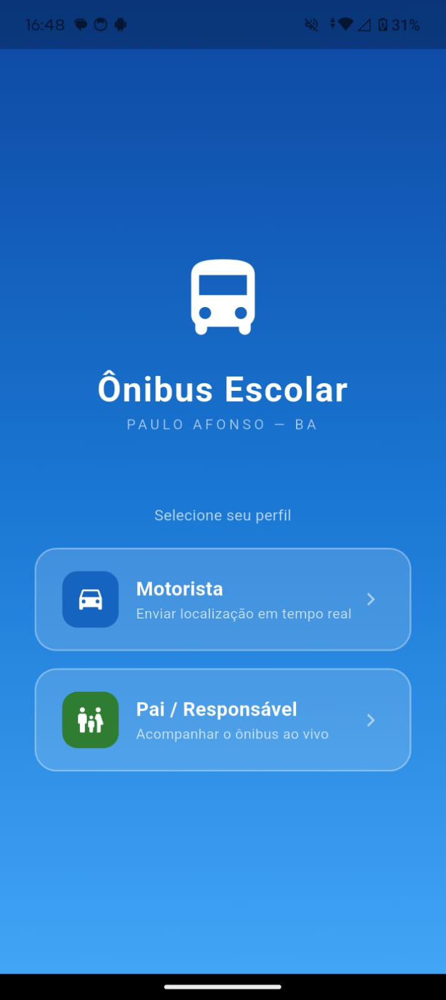 | 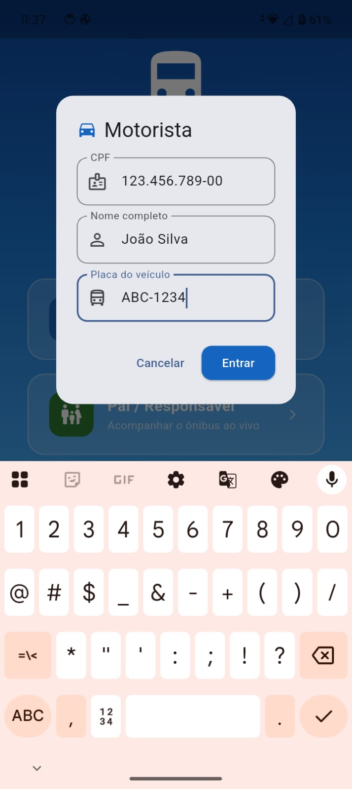 | 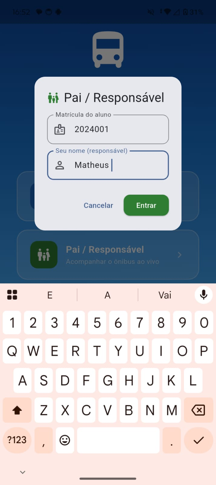 |
| *Escolha entre Motorista ou Responsável* | *Autenticação via CPF, nome e placa* | *Vínculo através da matrícula do aluno* |

### 🚛 Painel do Motorista (Durante a Rota)
| Aguardando Início | Localização Enviada | Alerta de Atraso Ativo | Motivos Disponíveis |
|:---:|:---:|:---:|:---:|
| 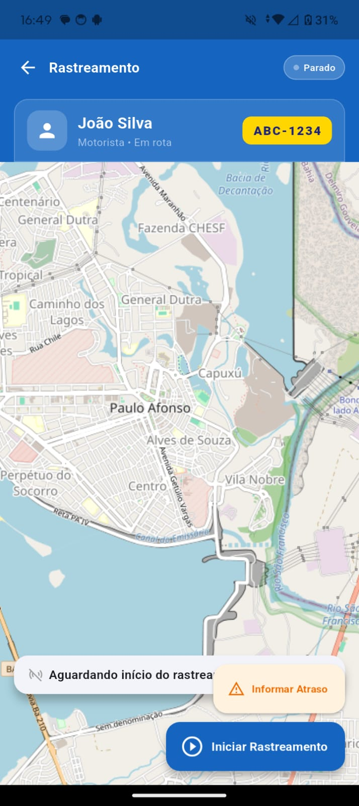 | 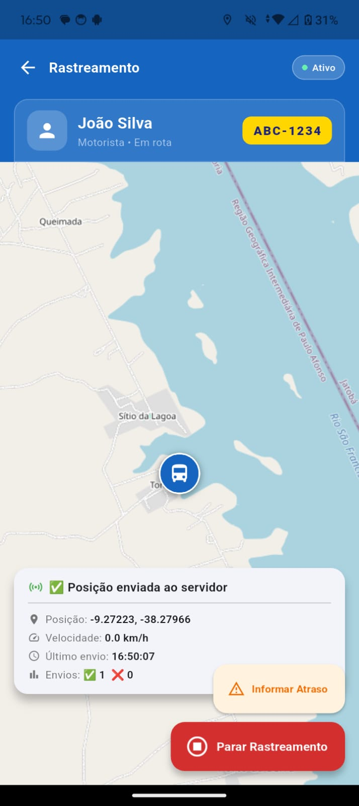 | 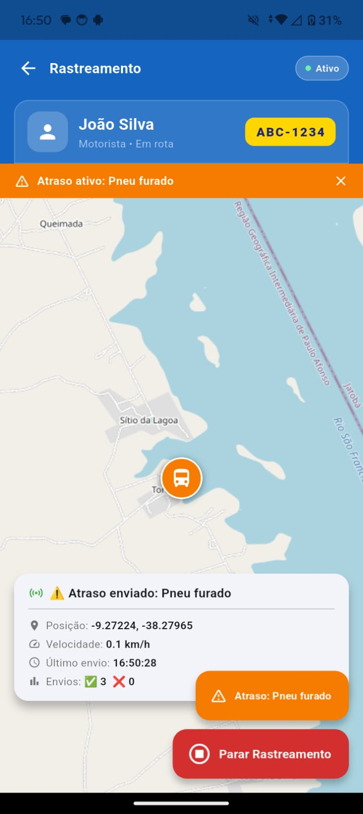 | 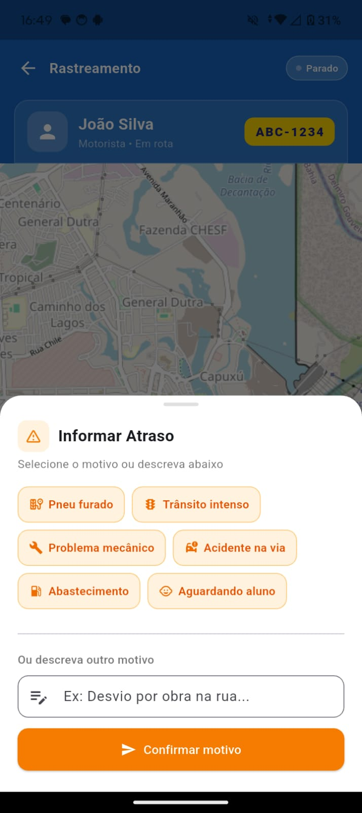 |
| *Mapa baseado em OpenStreetMap* | *Feedback em tempo real do envio* | *Banner laranja indicativo de atraso* | *Seis motivos pré-definidos + opção customizada* |

### 👨‍👩‍👦 Painel dos Responsáveis (Monitoramento)
| Acompanhamento ao Vivo | Tratamento de Erro |
|:---:|:---:|
| 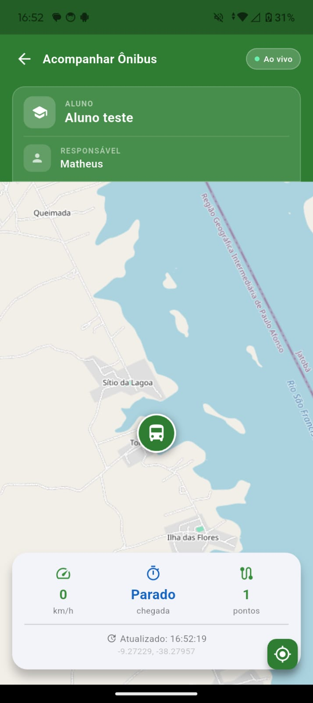 | 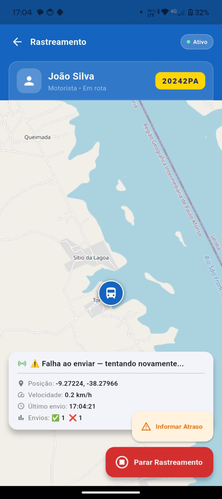 |
| *Visualização do ônibus no mapa com rastro de trajeto* | *Feedback amigável em caso de falha de conexão* |

---

## 🧪 Validação em Campo: Teste de Longa Distância

O marco de validação do projeto ocorreu durante um teste real conectando o **Distrito de Quixaba** (Paulo Afonso-BA) ao **Povoado Torquato (Glória-BA)** — uma rota rural com cobertura de rede móvel intermitente.

### 📱 Dois Dispositivos, Uma Conexão em Tempo Real
<p align="center">
  <kbd>
    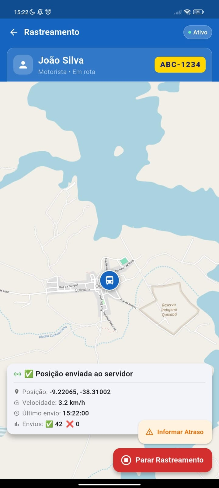
  </kbd>
  &nbsp;&nbsp;&nbsp;&nbsp;
  <kbd>
    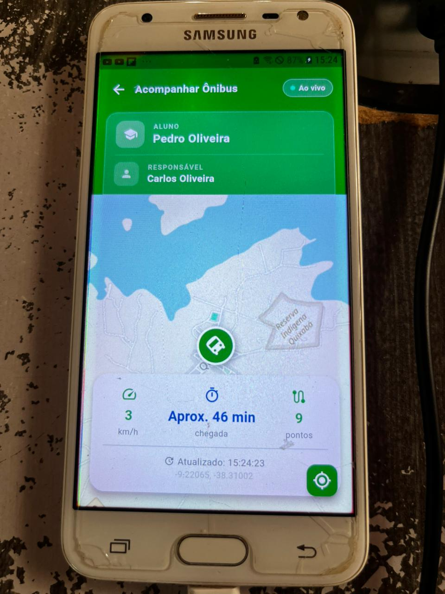
  </kbd>
</p>

### 🖥️ Monitoramento do Servidor (Logs do Ngrok)
Evidência técnica do túnel HTTP recebendo requisições `POST` originadas da Quixaba através de rede móvel:

<p align="center">
  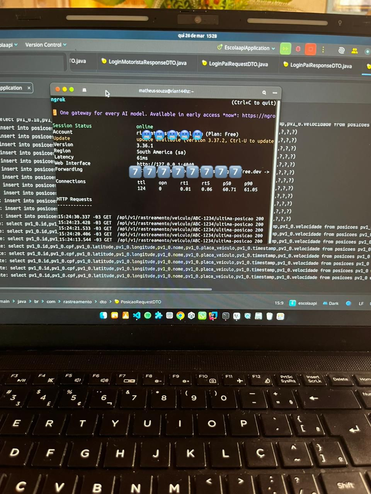
</p>

> **✅ Resultado Validado**: O motorista (imagem esquerda) transmitiu dados de uma rede externa e o responsável (imagem direita) recebeu a atualização com **latência inferior a 2 segundos**. Comprovação de que a arquitetura é funcional em condições reais de campo.

---

## 🗄️ Backend e Persistência de Dados

| Registro de Telemetria (Posições) | Controle de Acesso (Responsáveis) |
|:---:|:---:|
|  |  |
| *Tabela `atrasos` armazenando telemetria completa* | *Tabela `alunos` com controle de status e vínculo familiar* |

---

## 🛠️ Stack Tecnológica Detalhada

### 📱 Frontend — Aplicativo Mobile (Flutter)

**Flutter** é o framework open-source da Google para desenvolvimento de interfaces nativas multiplataforma (iOS/Android) a partir de um único código-base em Dart.

| Responsabilidade | Tecnologia/Pacote | Descrição |
|---|---|---|
| Captura de GPS em tempo real | `geolocator` | Biblioteca que abstrai acesso à localização do dispositivo com suporte a permissões |
| Renderização de mapas | `flutter_map` + `latlong2` | Widget para exibição de mapas interativos baseados em OpenStreetMap |
| Comunicação HTTP | `http` (Dart SDK) | Cliente para requisições REST assíncronas ao backend Spring Boot |
| Notificações Push | `firebase_messaging` | Integração com Firebase Cloud Messaging para recebimento de alertas |
| Formatação de datas | `intl` | Internacionalização e formatação de datas/horários |

**Arquitetura Flutter**: O app segue uma estrutura modular com separação clara entre:
- **Screens**: Componentes de interface (UI) reativos ao estado
- **Services**: Lógica de comunicação com APIs, autenticação e GPS
- **Models**: Estruturas de dados tipadas

---

### ☕ Backend — API REST (Spring Boot)

**Spring Boot** é o framework Java que simplifica a criação de aplicações stand-alone, prontas para produção, com configuração mínima e arquitetura baseada em microsserviços.

| Responsabilidade | Tecnologia | Descrição |
|---|---|---|
| Linguagem e runtime | **Java 21 (LTS)** | Versão LTS com melhorias de performance e padrões modernos |
| Framework principal | **Spring Boot 3.x** | Framework opinionado para aplicações empresariais |
| Persistência de dados | **Spring Data JPA** + **PostgreSQL** | Abstração de acesso a dados com mapeamento objeto-relacional |
| Redução de código boilerplate | **Lombok** | Anotações que geram getters, setters e construtores em tempo de compilação |
| Notificações Push | **Firebase Admin SDK** | SDK oficial para comunicação segura com FCM a partir do servidor |
| Containerização | **Maven** | Gerenciamento de dependências e build automatizado |

**Padrões Arquiteturais**:
- **MVC (Model-View-Controller)**: Separação entre controllers REST, serviços de negócio e modelos de dados
- **Repository Pattern**: Interfaces JPA para abstração completa do acesso ao banco
- **DTO (Data Transfer Objects)**: Objetos imutáveis para transferência segura de dados entre camadas
- **Injeção de Dependências**: IoC container do Spring para desacoplamento de componentes

---

### ☁️ Infraestrutura e DevOps

| Responsabilidade | Tecnologia | Descrição |
|---|---|---|
| Banco de dados relacional | **PostgreSQL 14+** | SGBD robusto, open-source, com suporte a JSON e extensões geoespaciais |
| Sistema operacional | **Linux Ubuntu** | Distribuição estável para servidores de aplicação |
| Túnel reverso (MVP) | **Ngrok** | Exposição temporária de localhost para WAN, útil para demos e testes |
| Plataforma de notificações | **Firebase Cloud Messaging (FCM)** | Infraestrutura gerenciada da Google para push notifications |
| Gerenciamento de BD | **DBeaver** | Cliente universal para administração do PostgreSQL |

---

## 🚀 Guia de Instalação e Configuração

### 📋 Pré-requisitos de Ambiente

- **Java Development Kit (JDK)** 21 ou superior
- **Apache Maven** 3.9 ou superior
- **Flutter SDK** 3.x (stable channel)
- **PostgreSQL** 14 ou superior
- **Android Studio** ou **VS Code** com extensões Flutter
- **Conta Firebase** (gratuita) para configuração do FCM

---

### ⚙️ Configuração do Backend (Spring Boot)

**Passo 1 — Clonagem do repositório:**
```bash
git clone https://github.com/rian144hz/bustrackerpa.git
cd bustrackerpa/escolar-api/escolaapi
```

**Passo 2 — Configuração do banco de dados:**
Edite o arquivo `src/main/resources/application.properties`:
```properties
# Configuração PostgreSQL
spring.datasource.url=jdbc:postgresql://localhost:5432/bustrackerpa
spring.datasource.username=SEU_USUARIO
spring.datasource.password=SUA_SENHA
spring.jpa.hibernate.ddl-auto=update
spring.jpa.properties.hibernate.dialect=org.hibernate.dialect.PostgreSQLDialect
```

**Passo 3 — Credenciais do Firebase:**
1. Acesse o [Firebase Console](https://console.firebase.google.com/)
2. Crie um projeto ou selecione existente
3. Vá em Configurações > Contas de Serviço
4. Gere uma nova chave privada (baixará o arquivo JSON)
5. Renomeie o arquivo para `serviceAccountKey.json`
6. Coloque-o em: `src/main/resources/serviceAccountKey.json`

**Passo 4 — Execução da aplicação:**
```bash
# Compilação e execução via Maven Wrapper
./mvnw spring-boot:run

# Ou compile o JAR e execute
./mvnw clean package
java -jar target/escolaapi-0.0.1-SNAPSHOT.jar
```

A API estará disponível em `http://localhost:8080`.

---

### 📱 Configuração do Frontend (Flutter)

**Passo 1 — Instalação de dependências:**
```bash
cd bustrackerpa/escolar_app
flutter pub get
```

**Passo 2 — Configuração da URL base da API:**
Edite os arquivos de serviço para apontar ao seu backend:
- `lib/service/api_service.dart`
- `lib/service/auth_service.dart`

```dart
static const String baseUrl = 'http://SEU_IP_LOCAL:8080/api/v1/rastreamento';
// Para testes com Ngrok: 'https://seu-tunnel.ngrok.io/api/v1/rastreamento'
```

**Passo 3 — Configuração do Firebase (Android):**
1. No Firebase Console, adicione um app Android ao projeto
2. Informe o package name: `br.com.rastreamento.escolar`
3. Baixe o arquivo `google-services.json`
4. Coloque-o em: `android/app/google-services.json`

**Passo 4 — Execução do app:**
```bash
# Verifique se há dispositivos conectados ou emuladores
flutter devices

# Execute o app em modo debug
flutter run

# Ou em modo release para testes de performance
flutter run --release
```

---

## 📈 Roadmap de Evolução do Produto

O MVP está validado em campo. As próximas etapas para o produto completo incluem:

- [ ] **🔔 Notificações Inteligentes** — Alertas personalizados por rota, horário e distância
- [ ] **⏱️ Algoritmo de ETA (Estimated Time of Arrival)** — Cálculo de previsão de chegada baseado em velocidade média, histórico e distância restante
- [ ] **🚧 Geofencing** — Cercas virtuais para alertar automaticamente quando o ônibus estiver a X metros da residência do aluno
- [ ] **📊 Painel Administrativo Web** — Dashboard em React ou Angular para gestores escolares monitorarem múltiplas rotas simultaneamente
- [ ] **🔐 Autenticação JWT (JSON Web Tokens)** — Substituição da validação simples por tokens assinados, expiráveis e revogáveis
- [ ] **☁️ Deploy em Nuvem** — Migração do Ngrok para VPS (AWS Lightsail, DigitalOcean, Railway) com domínio fixo, SSL/TLS e CDN
- [ ] **🏫 Arquitetura Multi-tenant** — Suporte a múltiplas escolas, rotas e municípios em uma única instância da aplicação
- [ ] **📱 Aplicativo iOS** — Build e publicação na App Store para alcance total aos responsáveis

---

## 📂 Estrutura de Diretórios do Projeto

```
bustrackerpa/
├── 📦 escolar-api/                     # Backend Spring Boot
│   └── escolaapi/
│       └── src/main/java/br/com/rastreamento/
│           ├── config/                 # Configurações de CORS, Firebase, Security
│           ├── controller/             # Endpoints REST (RastreamentoController)
│           ├── dto/                    # Objetos de transferência de dados
│           ├── model/                  # Entidades JPA (Aluno, Motorista, PosicaoVeiculo)
│           ├── repository/             # Interfaces Spring Data JPA
│           └── service/              # Regras de negócio e integração Firebase
│
└── 📱 escolar_app/                     # Frontend Flutter
    ├── android/                        # Configurações específicas Android
    ├── lib/
    │   ├── screen/                     # Telas (TelaSelecaoPerfil, TelaMotorista, TelaPai)
    │   └── service/                    # Serviços (ApiService, AuthService, LocationService)
    └── pubspec.yaml                    # Dependências e metadados do app
```

---

## 🤖 Sobre o Desenvolvimento e Uso de IA

### Contexto do Projeto
O **BusTracker PA** foi concebido para resolver um problema real e urgente enfrentado pelas famílias do **sertão baiano**, especificamente na região de **Paulo Afonso-BA**. A proposta nasceu da observação direta das dificuldades de mobilidade escolar em áreas rurais.

### Metodologia de Desenvolvimento
Este projeto foi desenvolvido através de uma **colaboração híbrida entre inteligência humana e artificial**:

- **Arquitetura e Decisões Técnicas**: Modelagem do banco de dados, design dos endpoints REST, integração com Firebase e definição da arquitetura em camadas foram concebidas e implementadas pelo desenvolvedor humano.

- **Implementação e Documentação**: A inteligência artificial (Claude, da Anthropic) foi utilizada como ferramenta de aceleração no desenvolvimento das interfaces Flutter, refinamento de código, geração de comentários explicativos e debug de ambientes Linux.

- **Validação e Segurança**: Todas as decisões críticas de segurança, regras de negócio e validação em campo foram conduzidas por supervisão humana direta.

### Propósito Social
Aplicar Engenharia de Software e tecnologia acessível para trazer **segurança, previsibilidade e tranquilidade** às famílias que dependem do transporte escolar público no interior da Bahia.

---

<p align="center">
  Desenvolvido com ☕, Flutter e colaboração humano-IA no sertão da Bahia.<br/>
  <strong>Paulo Afonso — BA • 2025</strong>
</p>
